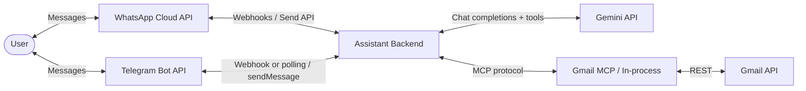
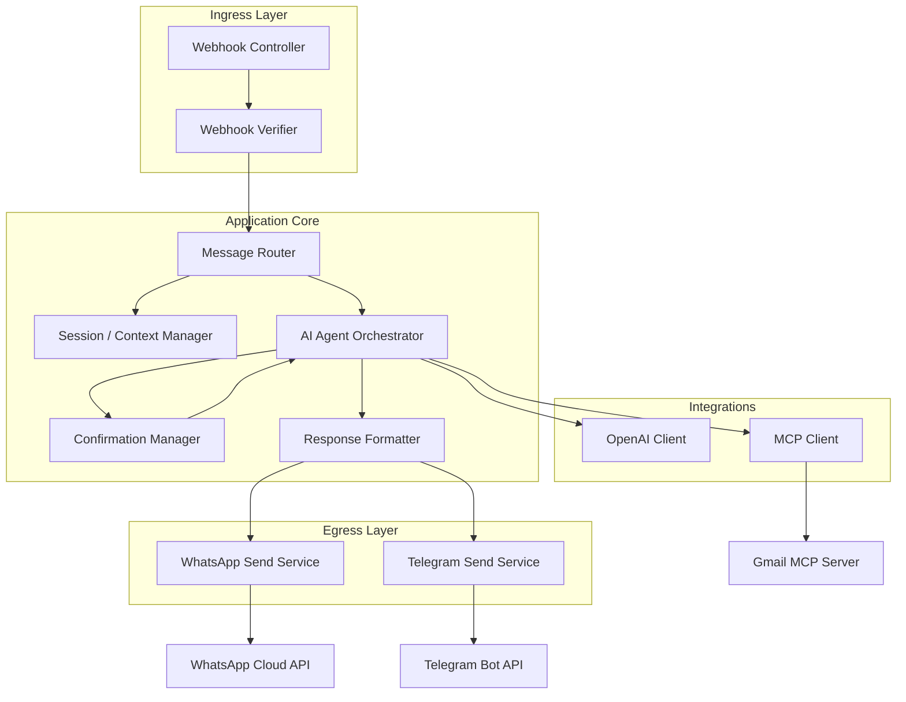
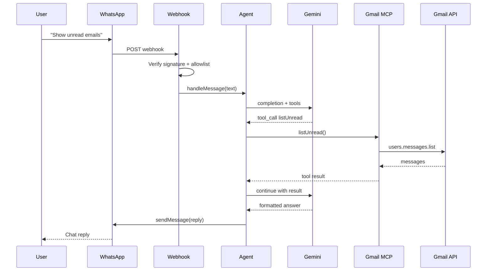
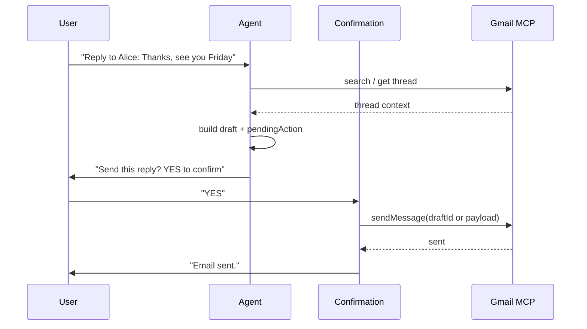
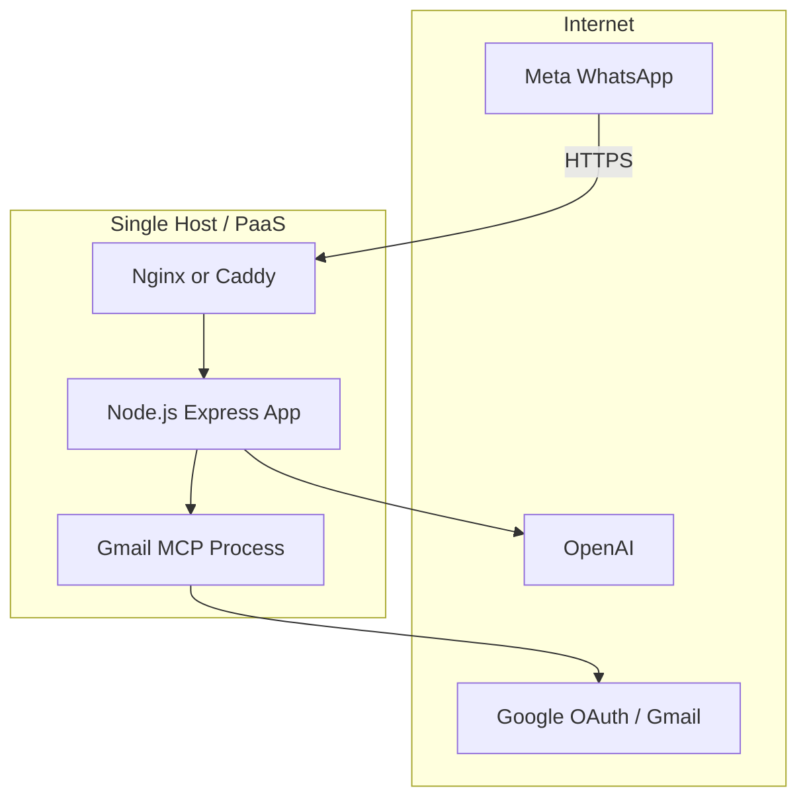

# Personal AI Gmail Assistant — System Architecture

## 1. Overview

The **Personal AI Gmail Assistant** is a single-user system that lets you manage Gmail through natural-language messages on **WhatsApp** and/or **Telegram**. You send a message in chat; an AI agent interprets intent, calls Gmail capabilities via MCP tools, and returns a formatted reply in the same thread.

This document describes the technical architecture for the MVP: components, data flows, integrations, security, deployment, and operational constraints. It aligns with the project plan in [`problem_statement_doc_809303f3.plan.md`](./problem_statement_doc_809303f3.plan.md).

| Attribute | Value |
|-----------|--------|
| **Scope** | Single user (personal assistant) |
| **Primary interfaces** | WhatsApp (Meta Cloud API) and/or Telegram (Bot API) |
| **Backend runtime** | Node.js + Express |
| **Intelligence** | Google Gemini (function-calling agent, default `gemini-2.5-flash-lite`) |
| **Email integration** | Gmail API via MCP server |
| **Auth model** | Gmail OAuth 2.0; WhatsApp webhook HMAC; Telegram bot token + optional webhook secret |

---

## 2. Goals and Non-Goals

### 2.1 Goals (MVP)

| Capability | Description |
|------------|-------------|
| Read unread emails | List and display unread messages with key metadata |
| Summarize inbox | Aggregate summary of recent/unread mail |
| Search emails | Query by sender, subject, keywords, date range |
| Draft a reply | Generate reply text from user instructions |
| Send email | Send only after explicit user confirmation in WhatsApp |

**Success criteria (from plan):**

- End-to-end flow: WhatsApp message → agent → Gmail → reply in WhatsApp
- Read operations complete in **under 5 seconds** (p95, typical inbox size)
- Write operations (send) require **explicit confirmation** before execution

### 2.2 Non-Goals (MVP)

- Multi-user / multi-tenant support
- Voice input or audio replies
- Autonomous scheduling or sending without confirmation
- Google Calendar or other Google Workspace products
- Proactive push notifications (e.g. “new email” alerts without user asking)

---

## 3. System Context

External actors and systems interact with a single deployed backend service.



**Trust boundaries:**

- **Public internet:** WhatsApp and/or Telegram → your HTTPS URL (WhatsApp: verify signatures; Telegram: optional `secret_token`).
- **Secrets:** OAuth tokens, API keys, webhook tokens — server-side only, never in client or logs.
- **User data:** Email content flows through your server and the LLM; minimize retention and redact logs.

---

## 4. High-Level Architecture

The system follows a **webhook- or polling-driven, agent-orchestrated** pattern: the active chat channel delivers events; Express validates and routes them; an agent loop decides which Gmail MCP tools to call; results are formatted and sent back via WhatsApp Messages API or Telegram `sendMessage`.



### 4.1 Layer Responsibilities

| Layer | Responsibility |
|-------|----------------|
| **Ingress** | HTTP server, webhook GET (verification), POST (messages), signature validation |
| **Application core** | Intent handling, conversation state, agent loop, human-in-the-loop for sends |
| **Integrations** | Gemini for reasoning; MCP or in-process for Gmail operations |
| **Egress** | Outbound WhatsApp messages (text; optional typing/read indicators if supported) |

---

## 5. Component Design

### 5.1 Webhook Controller (`routes/webhook.js`)

- **GET** `/webhook`: Meta verification handshake (`hub.mode`, `hub.verify_token`, `hub.challenge`).
- **POST** `/webhook`: Receives message payloads; responds `200` quickly, processes asynchronously where possible to avoid Meta retries/timeouts.
- Parses `entry[].changes[].value.messages[]` for text; ignores unsupported types in MVP (images, stickers) with a polite fallback reply.

### 5.2 Webhook Verifier (`middleware/verifyWhatsApp.js`)

- Validates `X-Hub-Signature-256` using app secret and raw request body.
- Rejects unsigned or invalid requests before any agent work runs.

### 5.3 Message Router (`services/messageRouter.js`)

- Maps inbound WhatsApp `from` (phone number ID / wa_id) to the **single allowed user** (allowlist in env).
- Drops or ignores messages from unknown senders (security for personal MVP).
- Dispatches to agent or confirmation handler based on session state.

### 5.4 Session / Context Manager (`services/sessionManager.js`)

- In-memory store for MVP (Map keyed by `wa_id`); optional Redis later.
- Holds:
  - Short **conversation history** (last N turns for LLM context).
  - **Pending action** (e.g. draft send awaiting `YES` / `CONFIRM`).
  - **Correlation IDs** for logging.
- TTL: expire idle sessions after configurable hours.

### 5.5 AI Agent Orchestrator (`services/agent.js`)

Central loop:

1. Build system prompt (role, Gmail capabilities, safety rules, confirmation policy).
2. Attach user message + trimmed history.
3. Call Gemini with **tool definitions** mirroring Gmail MCP tools.
4. On tool call: execute via MCP client or **in-process** (`gmailInProcess.js`); append tool result; continue until final natural-language answer or confirmation gate.
5. Return structured outcome: `{ type: 'reply' | 'confirm', text, pendingAction? }`.

**Model:** `gemini-2.5-flash-lite` (primary), fallback `gemini-2.5-flash` — cost-efficient with function calling.

**Performance:** With `AGENT_FAST_REPLY=1`, read/draft tools skip the second Gemini call and format locally.

**Tool-calling policy:**

- Read-only tools: auto-execute.
- `send_email` (or equivalent): never auto-execute; set `pendingAction` and ask user to confirm.

### 5.6 Confirmation Manager (`services/confirmation.js`)

- States: `idle` → `awaiting_send_confirm` → `idle`.
- Accepts explicit affirmatives (`yes`, `confirm`, `send it`) and negatives (`no`, `cancel`).
- On confirm: executes pending MCP send; clears pending state; reports success/failure.
- On cancel: clears pending draft; acknowledges cancellation.

### 5.7 MCP Client (`integrations/mcpClient.js`)

- Uses **MCP SDK** or **in-process Gmail** (`GMAIL_INPROCESS=1`) when stdio subprocess is slow (WSL `/mnt/d/`).
- Exposes typed wrappers: `listUnread`, `searchMessages`, `getMessage`, `createDraft`, `sendMessage`, etc., as defined by the server’s tool schema.
- Handles connection lifecycle, timeouts, and error mapping to user-safe messages.

### 5.8 Gmail MCP Server (external process)

- Separate package/process implementing MCP tools over **Gmail API** with **OAuth 2.0** credentials.
- Stores refresh token securely (file or secret store); refreshes access token automatically.
- Scopes (minimum for MVP): `gmail.readonly`, `gmail.send`, `gmail.compose` (adjust to least privilege once tool set is fixed).

### 5.9 WhatsApp Send Service (`services/whatsapp.js`)

- POST to `/{phone-number-id}/messages` with Bearer token.
- Sends text replies; splits long messages if over WhatsApp limits (~4096 chars) with sensible chunking.
- Retries transient 5xx with exponential backoff (cap attempts).

### 5.10 Response Formatter (`services/formatter.js`)

- Converts raw email JSON into compact WhatsApp-friendly text (numbered list, truncated bodies, link to open in Gmail if needed).
- Strips HTML; limits body preview length.

---

## 6. Request Flows

### 6.1 Read Path (e.g. “Show my unread emails”)



**Latency budget:** webhook ack &lt; 1s; read pipeline target **&lt; 5s** total (agent + Gmail).

### 6.2 Write Path with Confirmation (e.g. “Reply to Alice: …”)



No send occurs until the user explicitly confirms.

---

## 7. Gmail MCP Tool Surface (MVP)

Exact names depend on the MCP server implementation; the agent should expose equivalents:

| Tool | Purpose | Side effects |
|------|---------|--------------|
| `list_unread` | Unread messages with snippet | None |
| `summarize_inbox` | Aggregate recent/unread summary | None (may batch read internally) |
| `search_emails` | Query with Gmail search syntax | None |
| `get_email` | Full or partial message by ID | None |
| `create_draft` | Create draft reply | Writes draft only |
| `send_email` | Send message | **Requires confirmation gate in app** |

The **application layer** enforces confirmation even if the MCP tool could send directly.

---

## 8. AI Agent Design

### 8.1 System Prompt (guidelines)

- You are a personal Gmail assistant reachable via WhatsApp.
- Use tools for factual email data; do not invent message contents.
- For send/reply: always show draft and wait for confirmation.
- Keep replies concise; use bullet lists for multiple emails.
- If ambiguous (which “John”?), ask one clarifying question.

### 8.2 Context Window Management

- Keep last **5–10** turns of user/assistant messages.
- Summarize or drop tool raw payloads from history; keep only user-visible outcomes.
- Truncate individual email bodies in tool results (e.g. first 500 chars).

### 8.3 Failure Modes

| Situation | Behavior |
|-----------|----------|
| Gmail auth expired | User message: re-auth link or setup instructions |
| Tool timeout | “Gmail is slow right now; try again.” |
| LLM refusal / parse error | Generic retry message; log request ID |
| Unknown intent | Suggest example commands |

---

## 9. Security Architecture

### 9.1 Authentication and Authorization

| Integration | Mechanism |
|-------------|-----------|
| WhatsApp webhook | `hub.verify_token` on setup; `X-Hub-Signature-256` on each POST |
| WhatsApp send API | Long-lived **access token** (env) |
| Telegram | Bot token; optional `X-Telegram-Bot-Api-Secret-Token` on webhook |
| Telegram send | `sendMessage` via Bot API |
| Gmail | OAuth 2.0 authorization code flow; refresh token stored server-side |
| Gemini | API key (env) |
| User access | Allowlist `WHATSAPP_ALLOWED_WA_ID` and/or `TELEGRAM_ALLOWED_CHAT_ID` |

### 9.2 Secret Management

- All secrets in environment variables or a secret manager (production).
- Never commit `.env`; provide `.env.example` only.
- Rotate WhatsApp token and OpenAI key on compromise.

### 9.3 Data Protection

- Do not log full email bodies or OAuth tokens.
- HTTPS only for webhook (TLS termination at reverse proxy or PaaS).
- Minimal retention: session data in memory with TTL; no long-term email storage on disk for MVP.

### 9.4 Threat Considerations

| Threat | Mitigation |
|--------|------------|
| Spoofed webhooks | Signature verification |
| Unauthorized WhatsApp users | Allowlist |
| Prompt injection via email body | System prompt: treat email content as untrusted data; tools return structured fields |
| Accidental send | Confirmation manager + agent policy |

---

## 10. Deployment Architecture

### 10.1 Recommended MVP Topology



- **Public URL** required for webhooks (e.g. ngrok for dev, **Render** for prod — see [RENDER_DEPLOY.md](./RENDER_DEPLOY.md)).
- MCP server as **child process** (stdio) or **in-process Gmail** on same host.
- Health endpoint: `GET /health` → `{ status: "ok" }`.

### 10.2 Environment Variables

| Variable | Description |
|----------|-------------|
| `PORT` | HTTP port (default 3000) |
| `MESSAGING_CHANNELS` | Comma-separated: `whatsapp`, `telegram` (default `whatsapp`) |
| `TELEGRAM_BOT_TOKEN` | From @BotFather (required if telegram enabled) |
| `TELEGRAM_ALLOWED_CHAT_ID` | Numeric chat id allowlist |
| `TELEGRAM_WEBHOOK_SECRET` | Optional; matches Telegram `secret_token` |
| `WHATSAPP_VERIFY_TOKEN` | Meta webhook verification |
| `WHATSAPP_ACCESS_TOKEN` | Cloud API bearer token |
| `WHATSAPP_PHONE_NUMBER_ID` | Sending messages |
| `WHATSAPP_APP_SECRET` | Signature validation |
| `WHATSAPP_ALLOWED_WA_ID` | Single-user allowlist |
| `GEMINI_API_KEY` | Google AI Studio API key |
| `GEMINI_MODEL` | e.g. `gemini-2.5-flash-lite` |
| `GEMINI_FALLBACK_MODELS` | e.g. `gemini-2.5-flash` |
| `GMAIL_INPROCESS` | `1` on WSL/Render (skip MCP subprocess) |
| `AGENT_FAST_REPLY` | `1` to skip 2nd Gemini call for read/draft tools |
| `GMAIL_MAX_RESULTS` | Default `3` for faster Gmail fetches |
| `GMAIL_OAUTH_CLIENT_ID` | Google OAuth client |
| `GMAIL_OAUTH_CLIENT_SECRET` | Google OAuth secret |
| `GMAIL_OAUTH_REDIRECT_URI` | OAuth callback URL |
| `GMAIL_REFRESH_TOKEN` | Stored after initial auth |
| `MCP_GMAIL_COMMAND` | Optional: spawn command for MCP server |
| `SESSION_TTL_HOURS` | Session expiry |

### 10.3 Observability

- Structured JSON logs: `requestId`, `wa_id`, `intent`, `tool`, `durationMs`, `error`.
- Metrics (optional): webhook count, agent latency, Gmail errors, confirmation rate.
- Alert on repeated Gmail 401 (token refresh failure).

---

## 11. Proposed Repository Layout

```
whatsapp_ai_assistant/
├── Docs/
│   ├── architecture.md          # this document
│   ├── problem_statement_doc_809303f3.plan.md
│   └── problemStatement.md      # (planned)
├── src/
│   ├── index.js                 # Express bootstrap
│   ├── routes/
│   │   ├── webhook.js           # WhatsApp (Meta)
│   │   └── telegram.js          # Telegram webhook
│   ├── middleware/
│   │   ├── verifyWhatsApp.js    # Phase 2
│   │   └── verifyTelegramWebhook.js
│   ├── services/
│   │   ├── agent.js
│   │   ├── confirmation.js
│   │   ├── formatter.js
│   │   ├── messageRouter.js
│   │   ├── sessionManager.js
│   │   ├── whatsapp.js
│   │   ├── telegram.js
│   │   ├── telegramUpdateHandler.js
│   │   └── messageDedupe.js
│   ├── integrations/
│   │   ├── mcpClient.js
│   │   ├── geminiClient.js
│   │   ├── geminiErrors.js
│   │   ├── gmailInProcess.js
│   │   └── mcpPool.js
│   └── config/
│       └── env.js
├── scripts/
│   └── gmail-oauth-setup.js     # One-time OAuth flow
├── .env.example
├── package.json
└── README.md
```

---

## 12. Performance and Reliability

| Metric | Target |
|--------|--------|
| Webhook HTTP response | &lt; 1s (ack); process async if needed |
| Read operations (E2E) | &lt; 5s p95 |
| Gmail API errors | User-friendly message + retry suggestion |
| WhatsApp rate limits | Queue or backoff on 429 |

**Idempotency:** Meta may retry webhooks; use `message.id` deduplication cache (short TTL) to avoid duplicate agent runs.

**Graceful degradation:** If Gemini is down or rate-limited, reply with user-safe message; use local Gmail formatter fallback when possible.

---

## 13. Production deployment (Render)

| Item | Value |
|------|--------|
| Host | Render free-tier Web Service |
| URL | `https://personal-mcp-ai-agent.onrender.com` |
| Webhook | `POST /telegram/webhook` |
| Health | `GET /health` |
| Setup script | `npm run telegram:set-webhook -- https://<host>` |

See [RENDER_DEPLOY.md](./RENDER_DEPLOY.md) and [full-flow-explanation.md](./full-flow-explanation.md).

---

## 14. Constraints and Risks

| Risk | Impact | Mitigation |
|------|--------|------------|
| OAuth token expiry / revocation | Gmail calls fail | Refresh token flow; monitor 401; clear re-auth instructions |
| WhatsApp API policy / template rules | Blocked sends | MVP uses session messages within 24h window; document requirement for user-initiated contact |
| LLM hallucination on email content | Wrong advice or fabricated emails | Tool-only facts for listings; show snippets from tool results |
| Latency on large inboxes | Misses &lt;5s goal | Pagination, limit N messages, parallel fetch where safe |
| Email content in third-party LLM | Privacy exposure | Minimize context; no training opt-out per OpenAI policy; user awareness in README |
| Webhook exposure | Abuse | Signature verify + allowlist + rate limit |

---

## 15. Future Architecture (Post-MVP)

- **Redis** for session store and webhook deduplication.
- **Job queue** (BullMQ) for long summarize operations.
- **Calendar MCP** as separate tool server.
- **Proactive notifications** via Gmail push (Pub/Sub) → internal event → WhatsApp template (requires Meta approval).
- **Multi-user** with per-user OAuth and tenant isolation in DB.

---

## 16. References

- [WhatsApp Cloud API — Webhooks](https://developers.facebook.com/docs/whatsapp/cloud-api/webhooks)
- [Telegram Bot API — setWebhook](https://core.telegram.org/bots/api#setwebhook)
- [Gmail API](https://developers.google.com/gmail/api)
- [Google Gemini API](https://ai.google.dev/gemini-api/docs)
- [Model Context Protocol](https://modelcontextprotocol.io/)
- [full-flow-explanation.md](./full-flow-explanation.md) — interview / end-to-end guide
- Project plan: [`problem_statement_doc_809303f3.plan.md`](./problem_statement_doc_809303f3.plan.md)

---

*Document version: 1.1 — Updated for Gemini, Telegram production on Render, in-process Gmail.*
