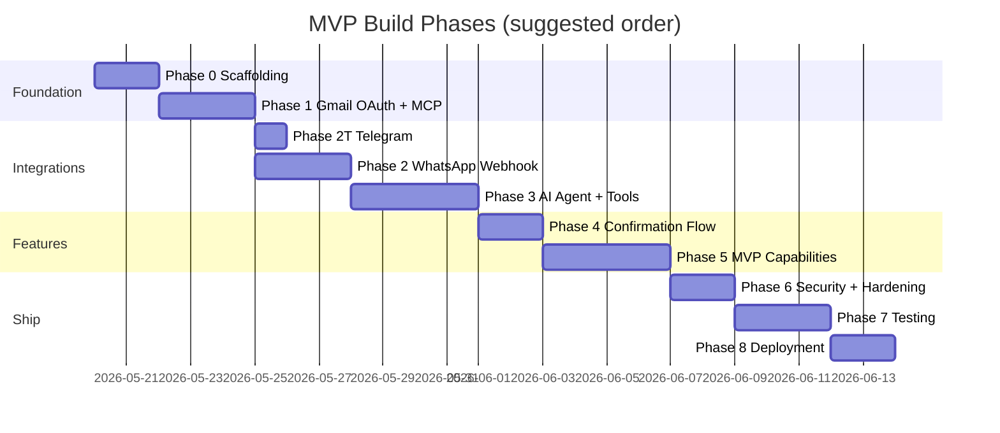
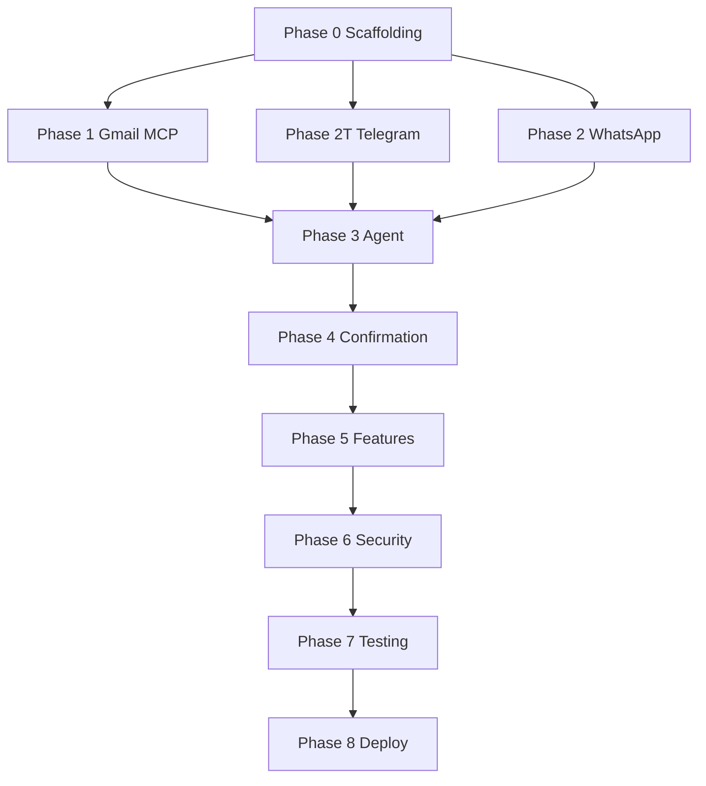

# Personal AI Gmail Assistant — Implementation Plan

## Current status (May 2026)

| Phase | Status | Notes |
|-------|--------|-------|
| 0 Scaffolding | ✅ Complete | Express, env, health |
| 1 Gmail OAuth + MCP | ✅ Complete | In-process Gmail on WSL/Render |
| 2T Telegram | ✅ Complete | Poll + webhook + Render prod |
| 2 WhatsApp | ⏸ Skipped | Stub at `/webhook` |
| 3 Gemini agent | ✅ Complete | Replaced OpenAI plan |
| 4 Confirmation | 🟡 Code done | E2E QA pending |
| 5 MVP features | 🟡 Partial | Read/search/draft work |
| 6 Security | 🟡 Partial | Allowlist, secrets hygiene |
| 7 Testing | 🟡 Partial | Manual smoke only |
| 8 Deployment | ✅ Complete | Render free + Telegram webhook |

**Study guide:** [full-flow-explanation.md](./full-flow-explanation.md)

---

## 1. Purpose

This document is the **step-by-step build guide** for the MVP. It turns the product intent in [`problem_statement_doc_809303f3.plan.md`](./problem_statement_doc_809303f3.plan.md) and the technical design in [`architecture.md`](./architecture.md) into ordered phases, tasks, acceptance criteria, and verification steps.

| Reference | Role |
|-----------|------|
| [Problem statement plan](./problem_statement_doc_809303f3.plan.md) | MVP scope, success criteria, risks |
| [Architecture](./architecture.md) | Components, flows, env vars, repo layout |

**MVP outcome:** A single user can message the assistant on **WhatsApp and/or Telegram**, read/search/summarize Gmail, draft replies, and send email only after explicit confirmation — with read operations under 5 seconds (p95) in typical conditions.

---

## 2. Implementation Summary



*Timeline is indicative (~3 weeks part-time); adjust to your schedule.*

| Phase | Focus | Est. effort |
|-------|--------|-------------|
| 0 | Project scaffolding | 0.5–1 day |
| 1 | Gmail OAuth + MCP server | 2–3 days |
| 2T | Telegram webhook/poll + send + echo | 0.5–1 day |
| 2 | WhatsApp webhook + send | 2–3 days |
| 3 | Gemini agent + tool bridge | 3–4 days |
| 4 | Send confirmation flow | 1–2 days |
| 5 | All five MVP features | 3–4 days |
| 6 | Security and reliability | 1–2 days |
| 7 | Integration and manual QA | 2–3 days |
| 8 | Production deployment | 1–2 days |

---

## 3. Prerequisites

Complete these **before Phase 1** code that calls external APIs.

### 3.1 Accounts and consoles

| Service | Action | Notes |
|---------|--------|--------|
| **Meta Developer** | Create app, add WhatsApp product, get test number | [developers.facebook.com](https://developers.facebook.com/) — if using WhatsApp |
| **Telegram** | Create bot via @BotFather, get bot token | [t.me/BotFather](https://t.me/BotFather) — if using Telegram |
| **Google Cloud** | Create project, enable Gmail API | [console.cloud.google.com](https://console.cloud.google.com/) |
| **Google OAuth** | OAuth consent screen (External/Testing), create Web client | Add redirect URI for local + prod |
| **OpenAI / Gemini** | API key | Model: `gemini-2.5-flash-lite` (implemented with Gemini) |
| **Hosting / tunnel** | ngrok (dev) or **Render** (prod) | Public HTTPS URL for webhook |

### 3.2 Local development tools

- **Node.js** 20 LTS (or 22)
- **npm** or **pnpm**
- **Git** (optional but recommended)
- **curl** or Postman for webhook tests

### 3.3 Gmail OAuth scopes (MVP)

Request minimum scopes needed for MVP tools:

- `https://www.googleapis.com/auth/gmail.readonly`
- `https://www.googleapis.com/auth/gmail.send`
- `https://www.googleapis.com/auth/gmail.compose`

Document scopes in README when created.

### 3.4 Knowledge checklist

- [ ] Read [architecture.md](./architecture.md) sections 4–7 and 9–10
- [ ] Understand WhatsApp 24-hour customer care window (user must message first)
- [ ] For Telegram dev: prefer `npm run telegram:poll` (no ngrok) before webhook deploy
- [ ] Understand MCP stdio vs HTTP transport choice for your host

---

## 4. Repository and Scaffolding (Phase 0)

**Goal:** Runnable Node project with config validation and health check — no business logic yet.

### 4.1 Tasks

| ID | Task | Output |
|----|------|--------|
| P0-1 | Initialize `package.json` (`type: module` or CommonJS — pick one, stay consistent) | `whatsapp_ai_assistant/package.json` |
| P0-2 | Add dependencies: `express`, `dotenv`, `openai`, `@modelcontextprotocol/sdk` | `package.json` |
| P0-3 | Add dev dependencies: `nodemon` (optional) | `package.json` |
| P0-4 | Create folder structure per [architecture §11](./architecture.md#11-proposed-repository-layout) | `src/`, `scripts/`, `Docs/` |
| P0-5 | Implement `src/config/env.js` — load and validate required env vars at startup | Fail fast on missing secrets |
| P0-6 | Implement `src/index.js` — Express app, `GET /health`, JSON body parser with **raw body** capture for webhook route | Health returns `{ status: "ok" }` |
| P0-7 | Add `.env.example` with all variables from [architecture §10.2](./architecture.md#102-environment-variables) | No real secrets |
| P0-8 | Add `.gitignore` (`.env`, `node_modules`, OAuth token files) | — |
| P0-9 | Draft `README.md` — setup overview, link to Docs | — |

### 4.2 Acceptance criteria

- [ ] `npm install` succeeds
- [ ] `npm start` (or `npm run dev`) starts server on `PORT`
- [ ] `GET http://localhost:3000/health` returns 200
- [ ] Missing required env var causes clear startup error

### 4.3 Commands (reference)

```bash
cd whatsapp_ai_assistant
npm init -y
npm install express dotenv openai @modelcontextprotocol/sdk
npm install -D nodemon
```

---

## 5. Gmail OAuth and MCP Server (Phase 1)

**Goal:** Gmail MCP process runs locally; backend can call `list_unread` (or equivalent) successfully.

### 5.1 Tasks

| ID | Task | Output |
|----|------|--------|
| P1-1 | Create Google OAuth client (Web application) | Client ID + secret in `.env` |
| P1-2 | Implement `scripts/gmail-oauth-setup.js` — authorization code flow, print/store refresh token | One-time setup script |
| P1-3 | Run OAuth script locally; save `GMAIL_REFRESH_TOKEN` to `.env` | Token never committed |
| P1-4 | Select or build **Gmail MCP server** (options below) | Runnable MCP command |
| P1-5 | Configure `MCP_GMAIL_COMMAND` in `.env` to spawn MCP via stdio | e.g. `npx @some/gmail-mcp` |
| P1-6 | Implement `src/integrations/mcpClient.js` — connect, list tools, invoke with timeout | Wrapper functions |
| P1-7 | Smoke test: call `list_unread` / `search_emails` from a tiny test script | Console shows real email metadata |

### 5.2 Gmail MCP server options

| Option | Pros | Cons |
|--------|------|------|
| **Existing community MCP server** (if available for Gmail) | Faster MVP | May not match exact tool names |
| **Custom minimal MCP server** in `mcp-gmail/` subfolder | Full control over tools | Extra 1–2 days |

**Recommendation:** Start by evaluating a maintained Gmail MCP package; if tool schema does not match [architecture §7](./architecture.md#7-gmail-mcp-tool-surface-mvp), implement a thin custom server with exactly six MVP tools.

### 5.3 MCP tool implementation checklist (if custom)

| Tool | Gmail API (approx.) | MVP priority |
|------|---------------------|----------------|
| `list_unread` | `users.messages.list` + `q=is:unread` | P5 |
| `summarize_inbox` | Batch list + snippets, agent-friendly JSON | P5 |
| `search_emails` | `users.messages.list` with `q` | P5 |
| `get_email` | `users.messages.get` | P5 |
| `create_draft` | `users.drafts.create` | P5 |
| `send_email` | `users.messages.send` | P5 (gated in app) |

### 5.4 Acceptance criteria

- [ ] Refresh token works; access token auto-refreshes
- [ ] MCP client connects on app startup (or lazy connect with retry)
- [ ] `list_unread` returns at least one message or empty array without crash
- [ ] Gmail 401 produces logged error and user-safe message string

---

## 5T. Telegram Bot and Outbound Messages (Phase 2T)

**Goal:** User can message the bot on Telegram and receive an echo reply; allowlist enforced; optional webhook or long polling for local dev.

**Status:** Implemented in repo (`src/routes/telegram.js`, `src/services/telegram*.js`, `scripts/telegram-*.js`).

### 5T.1 Tasks

| ID | Task | Output |
|----|------|--------|
| P2T-1 | Create bot via @BotFather; set `TELEGRAM_BOT_TOKEN` | Token in `.env` |
| P2T-2 | Set `MESSAGING_CHANNELS=telegram` (or `whatsapp,telegram`) | Channel gating in `env.js` |
| P2T-3 | Run `npm run telegram:chat-id`; set `TELEGRAM_ALLOWED_CHAT_ID` | Allowlist |
| P2T-4 | Implement `src/services/telegram.js` — `sendMessage`, chunk &gt;4096 | Graph-free send |
| P2T-5 | Implement `src/services/telegramUpdateHandler.js` — allowlist, dedupe, echo `pong` | Inbound path |
| P2T-6 | Implement `POST /telegram/webhook` + optional secret middleware | `routes/telegram.js` |
| P2T-7 | Implement `scripts/telegram-poll.js` for local dev without ngrok | `npm run telegram:poll` |
| P2T-8 | Shared `messageDedupe.js` (5 min TTL) | Reused by WhatsApp in Phase 2 |

### 5T.2 Telegram configuration

**Polling (recommended for dev):**

```bash
npm run telegram:poll
```

**Webhook (prod or ngrok):**

1. Callback URL: `https://<your-host>/telegram/webhook`
2. Optional: `TELEGRAM_WEBHOOK_SECRET` + `setWebhook` `secret_token` parameter
3. `npm start` must be running behind HTTPS

```bash
curl "https://api.telegram.org/bot<TOKEN>/setWebhook?url=https://<host>/telegram/webhook&secret_token=<SECRET>"
```

### 5T.3 Acceptance criteria

- [x] Text from allowlisted `chat_id` receives `pong`
- [x] Non-allowlisted chat ignored (logged, no Gmail/LLM)
- [x] Duplicate `message_id` not double-replied (5 min dedupe)
- [x] `GET /health` lists `telegram` in `channels` when enabled
- [x] Phase 3: replace echo with agent + Gmail MCP replies

---

## 6. WhatsApp Webhook and Outbound Messages (Phase 2)

**Goal:** Meta can verify webhook; inbound text triggers processing; bot can reply.

### 6.1 Tasks

| ID | Task | Output |
|----|------|--------|
| P2-1 | Configure WhatsApp Cloud API: phone number, temporary access token | Meta dashboard |
| P2-2 | Implement `src/middleware/verifyWhatsApp.js` — HMAC SHA-256 on raw body | Reject invalid signatures |
| P2-3 | Mount raw body parser **only** on `POST /webhook` before JSON parse | Required for signature |
| P2-4 | Implement `src/routes/webhook.js` — GET verification, POST handler | Routes wired in `index.js` |
| P2-5 | Implement `src/services/whatsapp.js` — send text, chunk long messages | Graph API client |
| P2-6 | Implement `src/services/messageRouter.js` — allowlist `WHATSAPP_ALLOWED_WA_ID` | Ignore strangers |
| P2-7 | Parse inbound text from webhook payload; echo test reply ("pong") | E2E without agent |
| P2-8 | Expose server via **ngrok**; register callback URL in Meta | Verified webhook |
| P2-9 | Add webhook **deduplication** by `message.id` (in-memory Map, 5 min TTL) | [architecture §12](./architecture.md#12-performance-and-reliability) |

### 6.2 Meta webhook configuration

1. Callback URL: `https://<your-host>/webhook`
2. Verify token: matches `WHATSAPP_VERIFY_TOKEN`
3. Subscribe to `messages` field
4. Send test message from your phone to business number

### 6.3 Acceptance criteria

- [ ] GET `/webhook` verification succeeds in Meta UI
- [ ] POST with valid signature returns 200 within 1 second
- [ ] Invalid signature returns 401/403
- [ ] Text message from allowlisted number receives echo reply
- [ ] Non-allowlisted sender gets no processing (optional: no reply)
- [ ] Duplicate `message.id` does not double-process

---

## 7. AI Agent and Tool Bridge (Phase 3)

**Goal:** Natural language inbound message → **Gemini** function calls → MCP → formatted chat reply (Telegram/WhatsApp).

**Status:** Implemented with Google Gemini (`src/integrations/geminiClient.js`, `src/services/agent.js`). OpenAI is not used.

### 7.1 Tasks

| ID | Task | Output |
|----|------|--------|
| P3-1 | Implement `src/integrations/geminiClient.js` — Gemini with function calling | `GEMINI_API_KEY`, `GEMINI_MODEL` |
| P3-2 | Define OpenAI tool schemas mirroring MCP tools (names + JSON schema) | `src/agent/tools.js` or inline |
| P3-3 | Implement `src/services/sessionManager.js` — history, TTL, pending action slot | In-memory Map |
| P3-4 | Implement `src/services/formatter.js` — email list → WhatsApp text | Truncation rules |
| P3-5 | Implement `src/services/agent.js` — agent loop (max iterations, e.g. 8) | See [architecture §5.5](./architecture.md#55-ai-agent-orchestrator-servicesagentjs) |
| P3-6 | Write system prompt file `src/agent/systemPrompt.js` | Confirmation policy, no hallucination |
| P3-7 | Wire `messageRouter` → `agent` → `whatsapp.send` | Replace echo with agent |
| P3-8 | Process webhook **asynchronously** after 200 response if processing &gt; 1s | Avoid Meta retries |
| P3-9 | Map MCP errors to short user messages | Timeout, 401, 429 |

### 7.2 Agent loop (pseudocode)

```
1. Load session history for wa_id
2. Append user message
3. Loop (max N):
   a. Call OpenAI with tools
   b. If no tool_calls → break with assistant text
   c. For each tool_call:
      - If send_email → do NOT call MCP; set pendingAction; return confirm prompt
      - Else → mcpClient.invoke(tool, args) → append tool result
4. Trim history (last 5–10 turns)
5. Format and return reply
```

### 7.3 Acceptance criteria

- [ ] "Show my unread emails" returns real data from Gmail (not fabricated)
- [ ] "Summarize my inbox" returns summary based on tool output
- [ ] "Search emails from X" uses `search_emails`
- [ ] Agent does not call `send_email` MCP directly without confirmation gate
- [ ] Read path E2E latency measured once; target &lt; 5s (log `durationMs`)

---

## 8. Confirmation Flow for Sends (Phase 4)

**Goal:** No email is sent until user explicitly confirms in WhatsApp.

### 8.1 Tasks

| ID | Task | Output |
|----|------|--------|
| P4-1 | Implement `src/services/confirmation.js` — state machine | `idle` / `awaiting_send_confirm` |
| P4-2 | Define `pendingAction` shape: `{ type, draftId?, to, subject, body, threadId? }` | Stored in session |
| P4-3 | Agent returns `{ type: 'confirm', text, pendingAction }` for send intents | No MCP send yet |
| P4-4 | Router: if session awaiting confirm, route to `confirmation.handle` first | YES / NO parsing |
| P4-5 | On YES: call MCP `send_email` (or send draft); clear pending; confirm to user | — |
| P4-6 | On NO: clear pending; "Cancelled." | — |
| P4-7 | Show full draft in confirmation message (to, subject, body preview) | User can verify |

### 8.2 Confirmation keywords

| Intent | Accepted inputs (case-insensitive) |
|--------|--------------------------------------|
| Confirm | `yes`, `y`, `confirm`, `send`, `send it`, `ok` |
| Cancel | `no`, `n`, `cancel`, `stop`, `abort` |

### 8.3 Acceptance criteria

- [ ] "Reply to …" produces draft preview + confirmation prompt
- [ ] "yes" sends exactly one email
- [ ] "no" does not send
- [ ] Unrelated message while awaiting confirm either cancels or asks "Reply YES or NO" (document chosen behavior)
- [ ] Double "yes" does not double-send (idempotent pending clear)

---

## 9. MVP Feature Completion (Phase 5)

**Goal:** All five MVP capabilities work reliably through WhatsApp.

### 9.1 Feature matrix

| Feature | User example prompts | MCP / agent tools | Done when |
|---------|---------------------|-------------------|-----------|
| Read unread | "Unread emails", "What’s new in my inbox?" | `list_unread` | Lists sender, subject, date, snippet |
| Summarize inbox | "Summarize my inbox", "Inbox summary" | `summarize_inbox` or `list_unread` + agent summary | Coherent short summary |
| Search | "Emails from Alice last week", "subject:invoice" | `search_emails` | Results ranked, max 10 by default |
| Draft reply | "Draft a reply to Bob: …" | `get_email`, `create_draft` | Draft text shown; not sent |
| Send with confirm | "Send that", "Reply to … and send" | `create_draft` + confirm + `send_email` | Sends only after YES |

### 9.2 Tasks per feature

| ID | Task |
|----|------|
| P5-1 | Tune `list_unread` defaults: `maxResults: 10`, include snippet |
| P5-2 | Implement `summarize_inbox` — cap messages, return structured JSON for LLM |
| P5-3 | Implement search — pass Gmail `q` syntax; document examples in README |
| P5-4 | Draft flow — resolve thread by search; show draft before optional send |
| P5-5 | Unsupported message types (image, audio) → polite text: "Text only for now." |
| P5-6 | Add example commands in first-time greeting (optional auto-reply on "hi") |

### 9.3 Acceptance criteria

- [ ] All five rows in [problem statement MVP table](./problem_statement_doc_809303f3.plan.md) pass manual tests
- [ ] Empty inbox / no results handled gracefully
- [ ] Long responses split under WhatsApp 4096 char limit

---

## 10. Security and Reliability (Phase 6)

**Goal:** Production-safe defaults for a personal deployment.

### 10.1 Tasks

| ID | Task | Reference |
|----|------|-----------|
| P6-1 | Enforce allowlist on every inbound message | [architecture §9.1](./architecture.md#91-authentication-and-authorization) |
| P6-2 | Redact tokens and email bodies from logs | [architecture §9.3](./architecture.md#93-data-protection) |
| P6-3 | Structured logging: `requestId`, `wa_id`, `tool`, `durationMs` | [architecture §10.3](./architecture.md#103-observability) |
| P6-4 | Rate limit webhook (e.g. 30 req/min per IP) — optional `express-rate-limit` | Abuse mitigation |
| P6-5 | Graceful handling: OpenAI down → maintenance message | [architecture §12](./architecture.md#12-performance-and-reliability) |
| P6-6 | Gmail 401 → instruct user to re-run OAuth script | Risk: token expiry |
| P6-7 | Session TTL job — sweep expired sessions every hour | `SESSION_TTL_HOURS` |

### 10.2 Acceptance criteria

- [ ] No secrets in git history or logs (spot-check)
- [ ] Spoofed webhook without signature rejected
- [ ] Tool results truncated before storing in long-term history

---

## 11. Testing (Phase 7)

**Goal:** Confidence to deploy; regressions caught for critical paths.

### 11.1 Test layers

| Layer | What to test | How |
|-------|----------------|-----|
| **Unit** | `confirmation` parsing, `formatter`, env validation | Node test runner (optional: `vitest` / `node:test`) |
| **Integration** | MCP client with mocked transport (optional) | Stub MCP responses |
| **Manual E2E** | Full WhatsApp → Gmail → reply | Real phone + test inbox |

### 11.2 Manual E2E test script

Execute in order; record pass/fail and latency.

| # | Step | Expected |
|---|------|----------|
| T1 | Send "hi" | Greeting or capability hint |
| T2 | "Show unread emails" | Real list &lt; 5s |
| T3 | "Summarize my inbox" | Summary without invented emails |
| T4 | "Search emails from &lt;known sender&gt;" | Relevant hits |
| T5 | "Draft reply to …: &lt;text&gt;" | Draft shown, not sent |
| T6 | "yes" without pending | No send; clarifying message |
| T7 | Complete send flow + "yes" | Email in Sent |
| T8 | Complete send flow + "no" | Nothing sent |
| T9 | Resend same webhook payload (simulate) | Single agent run |
| T10 | Message from non-allowlisted number | Ignored |

### 11.3 Performance check

- Log `durationMs` for T2 and T3 over 5 runs
- **Pass:** p95 &lt; 5000 ms for reads (typical inbox, &lt; 50 unread)

### 11.4 Acceptance criteria

- [ ] T1–T10 pass on dev environment
- [ ] No critical bugs open for send-without-confirm
- [ ] Optional: unit tests for confirmation + formatter (`npm test` green)

---

## 12. Deployment (Phase 8)

**Goal:** Stable public URL; same behavior as local.

### 12.1 Tasks

| ID | Task |
|----|------|
| P8-1 | Choose host (Railway, Render, Fly.io, VPS) |
| P8-2 | Set all env vars in host secret store |
| P8-3 | Deploy Node app; ensure HTTPS |
| P8-4 | Run Gmail MCP as child process or sidecar on same host |
| P8-5 | Update Meta webhook URL to production |
| P8-6 | Update Google OAuth redirect URIs if OAuth callback hosted |
| P8-7 | Smoke test T1–T3 on production |
| P8-8 | Document rollback: previous deploy + webhook URL |

### 12.2 Production checklist

- [ ] `GET /health` monitored (optional: UptimeRobot)
- [ ] `.env` not in container image; secrets from platform
- [ ] WhatsApp token expiry documented (long-lived token rotation)
- [ ] README: privacy note — email content sent to OpenAI

### 12.3 Acceptance criteria

- [ ] Production webhook verified in Meta
- [ ] Full E2E from personal phone works on prod URL
- [ ] Logs accessible without exposing PII

---

## 13. Master Task Checklist

Use this as a single tracking list (copy to issue tracker if desired).

### Foundation
- [x] P0-1 … P0-9 Phase 0 complete

### Gmail + MCP
- [x] P1-1 … P1-7 Phase 1 complete

### Telegram
- [x] P2T-1 … P2T-8 Phase 2T complete (code)
- [x] P2T-1 … P2T-3 BotFather + chat id in `.env`

### WhatsApp
- [ ] P2-1 … P2-9 Phase 2 complete (skipped for MVP)

### Agent
- [x] P3-1 … P3-9 Phase 3 complete (Gemini)

### Confirmation
- [x] P4-1 … P4-7 Phase 4 complete (code; E2E QA open)

### Features
- [ ] P5-1 … P5-6 Phase 5 complete

### Hardening
- [ ] P6-1 … P6-7 Phase 6 complete

### QA
- [ ] T1 … T10 Phase 7 complete

### Deploy
- [x] P8-1 … P8-8 Phase 8 complete (Render + webhook)

### Documentation
- [x] `Docs/problem_statement.md`
- [x] `README.md` setup and example commands
- [x] `Docs/full-flow-explanation.md` (interview guide)
- [x] `Docs/RENDER_DEPLOY.md`
- [x] Update this plan for Gemini + Render

---

## 14. Dependencies Between Phases



**Parallel work:** Phase 1, Phase 2T (Telegram), and Phase 2 (WhatsApp) can proceed in parallel after Phase 0; Phase 3 requires at least one messaging channel + Gmail MCP.

---

## 15. Definition of Done (MVP)

The MVP is **done** when all of the following are true:

1. **Product:** Single user can use all five capabilities via WhatsApp and/or Telegram ([problem statement](./problem_statement.md)).
2. **Safety:** Send requires explicit confirmation; allowlist enforced.
3. **Performance:** Read operations p95 &lt; 5s in typical test conditions.
4. **Security:** Webhook signature verified; secrets not in repo; minimal logging of PII.
5. **Ops:** Deployed to HTTPS URL; health check passes; README documents setup.
6. **Docs:** `architecture.md`, `implementationPlan.md`, and `problemStatement.md` exist and match behavior.

---

## 16. Risks During Implementation

| Risk | When | Mitigation |
|------|------|------------|
| MCP server mismatch | Phase 1 | Early spike; custom thin server if needed |
| Raw body + JSON parser conflict | Phase 2 | Separate route-level middleware for `/webhook` only |
| Meta webhook timeouts | Phase 3 | Ack fast; process async |
| LLM invents emails | Phase 3–5 | Tool-only facts in prompt; show snippets |
| OAuth test user limit | Phase 1 | Add your Gmail as test user on consent screen |
| WhatsApp 24h window | Phase 8 | User must message bot first; document in README |

---

## 17. Post-MVP Backlog (Do Not Build Now)

Aligned with [architecture §14](./architecture.md#14-future-architecture-post-mvp):

- Redis sessions and deduplication
- Multi-user support
- Voice messages
- Calendar integration
- Proactive new-mail notifications
- Job queue for heavy summarize operations

---

## 18. Suggested First Coding Session (Day 1)

1. Complete **Phase 0** (P0-1–P0-9) — ~2–4 hours.
2. Register Meta + Google consoles (**§3.1**) — ~1 hour.
3. Start **Phase 1** OAuth script (P1-1–P1-3) — ~2 hours.

After Day 1 you should have: running Express app, `.env.example`, and a valid Gmail refresh token.

---

## 19. References

- [architecture.md](./architecture.md) — components, env vars, flows
- [problem_statement_doc_809303f3.plan.md](./problem_statement_doc_809303f3.plan.md) — MVP scope and success criteria
- [WhatsApp Cloud API](https://developers.facebook.com/docs/whatsapp/cloud-api)
- [Gmail API](https://developers.google.com/gmail/api)
- [Model Context Protocol](https://modelcontextprotocol.io/)

---

*Document version: 1.0 — MVP implementation plan aligned with architecture v1.0.*
