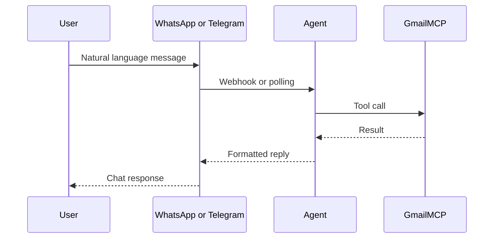

# Personal AI Gmail Assistant — Problem Statement

## 1. Project title

**Personal AI Gmail Assistant** (chat via WhatsApp and/or Telegram)

## 2. Problem statement

Managing email still means opening Gmail, scanning threads, and switching apps. For a single user who lives in mobile chat apps, there is no simple way to **ask in natural language** and get trustworthy Gmail actions (read, search, summarize, draft, send) **in the same conversation** without building a custom integration from scratch.

## 3. Target user

- **One person** — personal assistant, not multi-tenant SaaS  
- Comfortable with chat (WhatsApp or Telegram)  
- Wants Gmail control via short messages, not a new UI  

## 4. Current pain points

- Context-switching between chat and Gmail  
- No conversational “what’s unread?” or “search invoices from Acme” in chat  
- Replying on mobile is slow (find thread → compose → send)  
- **WhatsApp Cloud API** setup is heavy for hobby projects (Meta app, tokens, webhook, 24h window)  
- Fear of sending email by mistake without confirmation  

## 5. Proposed solution

A small **Node.js backend** receives messages from the user’s chosen channel (**WhatsApp** and/or **Telegram**), runs an **AI agent** with **Gmail MCP tools**, and returns formatted replies in chat. **Send** is allowed only after explicit user confirmation.

## 6. Core capabilities (MVP)

| Feature | Priority |
|---------|----------|
| Read unread emails | High |
| Summarize inbox | High |
| Search emails | High |
| Draft a reply | High |
| Send email (with confirmation) | High |

## 7. Out of scope (MVP)

- Multi-user / multi-tenant  
- Voice input or audio replies  
- Autonomous scheduling or sending without confirmation  
- Google Calendar or other Workspace products  
- Proactive “new mail” push without user asking  

## 8. Technical approach

- **Runtime:** Node.js 20+ and Express  
- **Chat ingress:** Meta WhatsApp Cloud API (`/webhook`) and/or Telegram Bot API (`/telegram/webhook` or long polling)  
- **Intelligence:** OpenAI `gpt-4o-mini` with tool calling (Phase 3+)  
- **Email:** Gmail API via bundled **MCP** server (`mcp-gmail/`) and OAuth 2.0 refresh token  
- **Security:** Channel allowlists (`WHATSAPP_ALLOWED_WA_ID`, `TELEGRAM_ALLOWED_CHAT_ID`); WhatsApp HMAC signature (Phase 2); optional Telegram webhook secret  

**Channel choice:** Telegram is supported as a **first-class, easier path** for development; WhatsApp remains supported for users who complete Meta setup. Configure with `MESSAGING_CHANNELS=telegram`, `whatsapp`, or `whatsapp,telegram`.

## 9. Success criteria

- End-to-end: chat message → agent → Gmail → reply in chat  
- Read operations under **5 seconds** (p95, typical inbox)  
- Send only after explicit confirmation in chat  
- **Telegram:** user messages bot → receives `pong` (Phase 2T), then Gmail answers (Phase 3+)  
- **WhatsApp:** Meta webhook verified; same Gmail flows when Phase 2 is complete  

## 10. Constraints and risks

- Email content passes through the server and LLM — minimize logging and retention  
- Gmail OAuth in **Testing** mode limits which Google accounts can sign in  
- WhatsApp **24-hour messaging window** and Meta policy complexity  
- Telegram bots are public by token — **never commit** `TELEGRAM_BOT_TOKEN`; use chat allowlist  
- LLM may hallucinate unless answers use **tool results only**  
- Single-user allowlist misconfiguration could block or expose the wrong user  
